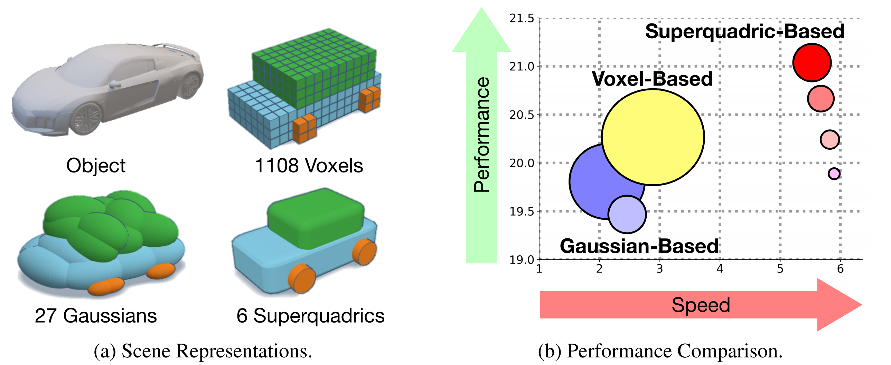
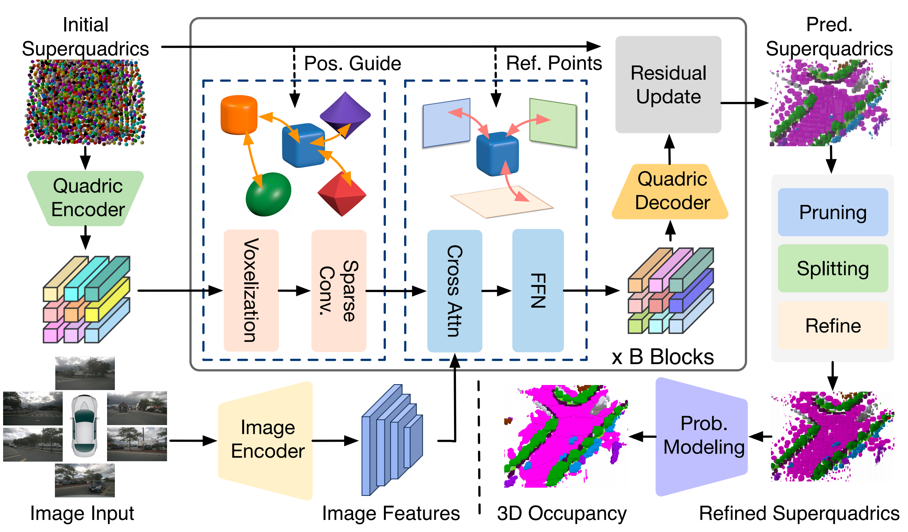

# QuadricFormer: Scene as Superquadrics for 3D Semantic Occupancy Prediction
### [Paper](https://arxiv.org/abs/2506.10977)

> QuadricFormer: Scene as Superquadrics for 3D Semantic Occupancy Prediction

> [Sicheng Zuo<sup>\*</sup>](https://scholar.google.com/citations?user=11kh6C4AAAAJ&hl=en&oi=ao), [Wenzhao Zheng<sup>\*</sup>](https://wzzheng.net/)$\dagger$,  Xiaoyong Han<sup>*</sup>, Longchao Yang, Yong Pan, [Jiwen Lu](http://ivg.au.tsinghua.edu.cn/Jiwen_Lu/)

<sup>\*</sup> Equal contribution. $\dagger$ Project leader.

QuadricFormer proposes geometrically expressive superquadrics as scene primitives, enabling efficient and powerful object-centric representation of driving scenes.




## Overview
We propose a probabilistic superquadric mixture model for efficient 3D occupancy prediction in autonomous driving scenes. Unlike previous methods based on dense voxels or ellipsoidal Gaussians, we leverage geometrically expressive superquadrics as scene primitives to effectively capture the diverse structures of real-world objects with fewer primitives. Our model interprets each superquadric as an occupancy distribution with geometry priors and aggregates semantics via probabilistic mixture. Additionally, we design a pruning-and-splitting module to dynamically allocate superquadrics in occupied regions, enhancing modeling efficiency. Extensive experiments on the nuScenes dataset demonstrate that QuadricFormer achieves state-of-the-art performance while significantly reducing computational costs.



## Getting Started

### Installation
Follow instructions [HERE](docs/installation.md) to prepare the environment.

### Data Preparation
1. Download nuScenes V1.0 full dataset data [HERE](https://www.nuscenes.org/download).

2. Download the occupancy annotations from SurroundOcc [HERE](https://github.com/weiyithu/SurroundOcc) and unzip it.

3. Download pkl files [HERE](https://cloud.tsinghua.edu.cn/d/095a624d621b4aa98cf9/).

4. Download the pretrained weights for the image backbone [HERE](https://cloud.tsinghua.edu.cn/f/00fea9c23eac448ea9f5/) and put it inside pretrain.

**Folder structure**
```
QuadricFormer
├── ...
├── data/
│   ├── nuscenes/
│   │   ├── maps/
│   │   ├── samples/
│   │   ├── sweeps/
│   │   ├── v1.0-test/
|   |   ├── v1.0-trainval/
│   ├── surroundocc/
│   │   ├── samples/
│   │   |   ├── xxxxxxxx.pcd.bin.npy
│   │   |   ├── ...
│   ├── nuscenes_temporal_infos_train.pkl
│   ├── nuscenes_temporal_infos_val.pkl
├── pretrain/
│   ├── r101_dcn_fcos3d_pretrain.pth
```

### Inference
We provide the following model configs on the SurroundOcc dataset. Checkpoints will be released soon.

| Name  | Repre | #Primitives | Latency | Memory| mIoU |
| :---: | :---: | :---: | :---: | :---: | :---: |
| GaussianFormer | Gaussians | 144000 | 372 ms | 6229 MB | 19.10 |
| GaussianFormer-2 | Gaussians | 12800 | 451 ms | 4535 MB | 19.69 |
| QuadricFormer-small | Quadrics | 1600  | 162 ms | 2554 MB | 20.04 |
| QuadricFormer-base | Quadrics | 6400  | 165 ms | 2560 MB | 20.79 |
| QuadricFormer-large | Quadrics | 12800  | 179 ms | 2563 MB | 21.11 |

Evaluate QuadricFormer on the SurroundOcc validation set:
```bash
bash scripts/eval_base.sh config/nusc_surroundocc_sq1600.py work_dir/ckpt.pth work_dir/xxxx
```

### Train

Train QuadricFormer on the SurroundOcc validation set:
```bash
bash scripts/train_base.sh config/nusc_surroundocc_sq1600.py work_dir/xxxx
```

### Visualize
Install packages for visualization according to the [documentation](docs/installation.md).

Visualize QuadricFormer on the SurroundOcc validation set:
```bash
bash scripts/vis_base.sh config/nusc_surroundocc_sq1600.py work_dir/ckpt.pth scene-0098 work_dir/xxxx
```

## Related Projects

Our work is inspired by these excellent open-sourced repos:
[TPVFormer](https://github.com/wzzheng/TPVFormer)
[PointOcc](https://github.com/wzzheng/PointOcc)
[SelfOcc](https://github.com/huang-yh/SelfOcc)
[GaussianFormer](https://github.com/huang-yh/GaussianFormer)
[SurroundOcc](https://github.com/weiyithu/SurroundOcc) 
[OccFormer](https://github.com/zhangyp15/OccFormer)
[BEVFormer](https://github.com/fundamentalvision/BEVFormer)

## Citation

If you find this project helpful, please consider citing the following paper:
```
@article{zuo2025quadricformer,
    title={QuadricFormer: Scene as Superquadrics for 3D Semantic Occupancy Prediction},
    author={Zuo, Sicheng and Zheng, Wenzhao and Han, Xiaoyong and Yang, Longchao and Pan, Yong and Lu, Jiwen},
    journal={arXiv preprint arXiv:2506.10977},
    year={2025}
}